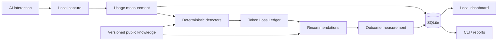

<div align="center">

# Tokenomics

### AI Token Efficiency for Engineers and Students

**Spend fewer tokens reaching a correct, verified result.**

Local-first token observability · waste detection · measurable optimization · privacy by design

[](LICENSE)


[Quick start](#quick-start) · [Why Tokenomics](#why-tokenomics) · [Architecture](#architecture) · [Knowledge](#privacy-safe-shared-knowledge) · [Documentation](#documentation)

</div>

---

Tokenomics is an open-source project for understanding where AI tokens are being spent, finding avoidable waste, and helping people reach correct, verified results with less rework.

It is **not just a token counter** and it is not primarily a prompt-compression tool. Tokenomics looks at the work around an AI interaction: repeated context, retries, polling, excessive output, hidden errors, ambiguous requests, and results that were never verified.

The first implementation target is Claude/Anthropic usage. The architecture is intended to remain vendor-neutral.

## Why Tokenomics

AI usage often becomes expensive because work gets done twice.

A request can consume relatively few tokens and still create significant waste when the result is incomplete, incorrectly formatted, based on an unstated assumption, or never verified. The next interaction then has to repeat the work.

Tokenomics treats that repeated work as **token loss**.

### The principle

> **The goal is not fewer tokens. The goal is fewer tokens to reach a correct, verified result.**

That distinction matters. A shorter prompt that produces a wrong answer is not an optimization.

## Tokenomics in 60 seconds

```text
                    AI interaction
                          │
                          ▼
                     ┌─────────┐
                     │ CAPTURE │
                     └────┬────┘
                          ▼
                     ┌─────────┐
                     │ MEASURE │  tokens · cost · timing
                     └────┬────┘
                          ▼
                     ┌───────────┐
                     │ UNDERSTAND│  session · context · outcome
                     └─────┬─────┘
                           ▼
                    ┌─────────────┐
                    │ DETECT LOSS │
                    └──────┬──────┘
                           ▼
                    ┌────────────┐
                    │ RECOMMEND  │
                    └──────┬─────┘
                           ▼
                    ┌────────────┐
                    │   EXECUTE  │
                    └──────┬─────┘
                           ▼
                    ┌────────────┐
                    │ MEASURE    │
                    │ AGAIN      │
                    └──────┬─────┘
                           ▼
                 Did we actually save?
                           │
                           ▼
                    Update local model
```

Tokenomics should also measure **its own overhead**. If analyzing a problem costs more than the savings it identifies, Tokenomics should back off rather than create more waste.

## What Tokenomics detects

The initial detection model focuses on practical sources of AI waste:

| Pattern | What it means | Example |
| --- | --- | --- |
| Repeated context | The same information is repeatedly sent to the model | Large files or logs pasted into every request |
| Rework | Earlier output was not sufficient to finish the task | Ambiguous requirements or an unchecked result |
| AI polling | AI is repeatedly invoked while monitoring something | A loop sends status output to AI every few seconds |
| Retry loops | Failed AI work is repeatedly retried without changing the cause | Blind retries after the same error |
| Excessive output | More information is generated or passed than the task requires | Full logs when only the conclusion is needed |
| Hidden errors | Errors are suppressed before AI or the user can see them | `2>/dev/null` |
| Hidden pipeline failures | A successful downstream command masks an upstream failure | `command | tail -20` |
| Empty-result traps | A zero result is treated as proof instead of being verified | Search returns nothing when known data exists |
| State confusion | Different states are treated as equivalent | Written ≠ merged ≠ released ≠ production |

These patterns are intentionally explainable. A finding should tell you **what happened, why it matters, and what can be changed**.

## Architecture

Tokenomics is designed local-first from the beginning.



### Core components

- **Capture**: records local usage events and token metadata.
- **Measurement**: calculates token counts, cost estimates, timing, and ratios.
- **Session analysis**: connects individual interactions into meaningful work sessions.
- **Detectors**: identifies known waste patterns without requiring a remote AI call.
- **Token Loss Ledger**: records where tokens were spent unnecessarily and why.
- **Recommendations**: proposes a more efficient approach rather than blindly rewriting requests.
- **Outcome tracking**: compares predicted savings with actual results.
- **Knowledge Registry**: distributes versioned, privacy-safe detection rules and optimization strategies.
- **Dashboard and CLI**: make the analysis useful both interactively and in engineering workflows.

## Privacy by design

**Private conversations stay private.**

Tokenomics is designed so that raw user data does not need to leave the machine.

Tokenomics does not upload or centralize:

- AI prompts or conversations
- AI responses
- Source code or file contents
- Filenames or local paths
- Environment variables or secrets
- API keys or credentials
- Personal messages or identifying information

The public knowledge layer contains generalized patterns and rules, not transcripts.

For example, a local installation might discover that repeated AI polling is expensive. The shareable knowledge is the pattern itself:

```yaml
pattern: ai_polling
trigger:
  ai_calls_per_minute: ">10"
  repeated_context_ratio: ">0.50"
recommendation: invoke AI only when meaningful state changes
```

The conversation that produced the observation remains local.

## Privacy-safe shared knowledge

Tokenomics separates **private experience** from **shared knowledge**.

```text
              Tokenomics Knowledge Registry
                         │
          ┌──────────────┼──────────────┐
          ▼              ▼              ▼
      Developer A    Developer B    Developer C
      local data    local data    local data
          │              │              │
          └───────┬──────┴──────┬───────┘
                  │              │
            private learning   optional
                               generalized
                                patterns
```

Knowledge can be versioned independently from the Tokenomics application. This allows detection rules, provider information, and optimization strategies to evolve without requiring private user data to be synchronized.

## Token Loss Ledger

One of the core concepts in Tokenomics is the **Token Loss Ledger**.

Instead of reporting only:

```text
You used 1,200,000 tokens.
```

Tokenomics should eventually be able to explain:

```text
1,200,000 tokens used

Estimated avoidable usage: 438,000

  190,000  repeated context
  120,000  AI polling
   74,000  retry/rework
   54,000  excessive output

Predicted savings: 36.5%
Actual savings after optimization: 31.8%

Confidence: 0.91
```

The important measurement is not merely **how much was spent**, but **where the loss occurred and whether the proposed fix worked**.

## AI-in-the-loop efficiency

AI-driven monitoring can create a particularly expensive feedback loop.

For example:

```text
1,000 tokens/request
× 12 requests/minute
= 12,000 tokens/minute
= 720,000 tokens/hour
```

A local process can usually perform the monitoring itself and invoke AI only when meaningful state changes occur.

Tokenomics is intended to detect patterns such as:

- `while true` loops
- `watch` / `watch -n`
- polling loops
- scheduled AI calls
- retry loops
- recursive agent calls
- long-running processes repeatedly feeding AI output back into the model

The objective is not to prevent automation. It is to identify when automation is spending tokens without producing proportional value.

## Roadmap

### Phase 1 · Local observability

- [ ] Local event model
- [ ] SQLite storage
- [ ] Claude/Anthropic usage capture
- [ ] Token and cost calculations
- [ ] Session timelines

### Phase 2 · Waste detection

- [ ] Repeated-context detection
- [ ] Rework detection
- [ ] Polling and monitoring detection
- [ ] Retry-loop detection
- [ ] Hidden-error detection
- [ ] Excessive-output detection
- [ ] Token Loss Ledger

### Phase 3 · Optimization

- [ ] Explainable recommendations
- [ ] Original vs optimized request comparison
- [ ] User approval before executing an optimization
- [ ] Predicted vs actual savings
- [ ] Net Tokenomics overhead measurement

### Phase 4 · Knowledge

- [ ] Versioned knowledge packs
- [ ] Provider-specific rules
- [ ] Community contribution workflow
- [ ] Automatic knowledge updates
- [ ] Compatibility and rollback support

### Phase 5 · Team workflows

- [ ] Local project `.tokenomics/` data
- [ ] Shareable findings
- [ ] Team-level aggregate metrics
- [ ] Deliberate project knowledge sharing
- [ ] No raw conversation synchronization

## Quick start

The project is currently in early development. The repository foundation and architecture are being established before the first runnable CLI is finalized.

The intended first-run experience is:

```bash
tokenomics init
tokenomics claude
tokenomics analyze
tokenomics dashboard
```

The implementation will remain local-first and will not require a cloud database, Kubernetes cluster, or centralized service for the core experience.

## Repository layout

```text
tokenomics/
├── tokenomics/          # application code
├── knowledge/           # versioned detection rules and strategies
├── docs/                # architecture, usage, privacy, updates
├── tests/               # automated tests
├── README.md
├── CONTRIBUTING.md
├── SECURITY.md
├── CHANGELOG.md
└── LICENSE
```

## Documentation

- [Architecture](docs/ARCHITECTURE.md): system boundaries, components, data flow, and design principles
- [Privacy](docs/PRIVACY.md): local-first data handling and the boundary between private data and shared knowledge
- [Usage](docs/USAGE.md): planned CLI and dashboard workflows
- [Updating](docs/UPDATING.md): application and knowledge-pack update strategy
- [Contributing](CONTRIBUTING.md): contribution workflow and development expectations
- [Security](SECURITY.md): security reporting and project security principles

## Design principles

### 1. Correctness before compression

A cheaper wrong answer is not a saving.

### 2. Local before remote

Analyze locally whenever deterministic analysis is sufficient.

### 3. Measure outcomes

Predicted savings are only a hypothesis. Tokenomics should measure what happened afterward.

### 4. Explain the loss

A useful finding identifies the behavior, impact, and practical alternative.

### 5. Privacy is an architectural boundary

Do not collect private conversations and promise to redact them later. Design the system so raw private data does not need to be shared.

### 6. Do not automate judgment

Tokenomics can identify patterns and make recommendations. The user remains in control of consequential actions.

### 7. Tokenomics must pay for itself

The analyzer must account for its own compute and AI usage. Optimization that costs more than it saves is not optimization.

## Contributing

Contributions are welcome, especially new explainable waste detectors, tests, provider integrations, documentation, and privacy-safe knowledge rules.

See [CONTRIBUTING.md](CONTRIBUTING.md) before opening a pull request.

## License

Tokenomics is licensed under the Apache License 2.0.

See [LICENSE](LICENSE) for the complete license text.

---

<div align="center">

**Tokenomics**

*Spend fewer tokens reaching a correct, verified result.*

An AI Token Efficiency Project by GGCLTMGT

</div>
