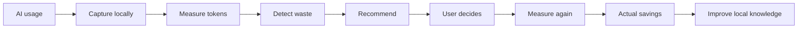
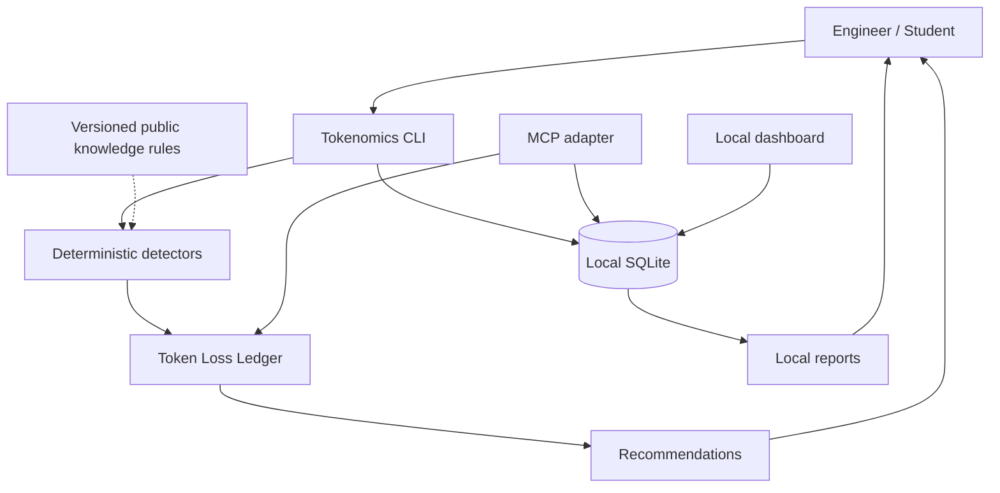

<div align="center">

# Tokenomics

### An AI Token Efficiency Project by GGCLTMGT

**Spend fewer tokens reaching a correct, verified result.**

Local-first AI token observability, waste detection, and measurable optimization for engineers and students.

[](https://github.com/thew0lf/tokenomics/actions/workflows/ci.yml)


[Quick start](#quick-start) · [Architecture](#architecture) · [MCP](#mcp) · [Privacy](#privacy) · [Documentation](#documentation)

</div>

---

## Why Tokenomics

AI usage is easy to measure and surprisingly hard to optimize.

The expensive part is often not a single large request. It is **rework**: an unchecked result, an unstated assumption, a hidden error, an unnecessarily large context, or an AI process that keeps getting called after the useful state has stopped changing.

Tokenomics treats tokens as an engineering resource. It records usage locally, identifies likely waste, recommends a change, and then measures whether the change actually saved anything.

> **The objective is not fewer tokens at any cost. The objective is fewer tokens to a correct, verified result.**

## Tokenomics in 60 seconds



Tokenomics does not assume that an optimization worked. An estimate is a hypothesis. The next measurement is the evidence.

## Architecture



The implementation is intentionally local and deterministic. Tokenomics does not need a cloud service to analyze a command, calculate token cost, or identify a known waste pattern.

## Quick start

Requires Python 3.11+.

```bash
git clone https://github.com/thew0lf/tokenomics.git
cd tokenomics
python -m venv .venv
source .venv/bin/activate
python -m pip install -e '.[dev]'
```

Initialize local storage:

```bash
tokenomics init
```

Record usage without storing the conversation:

```bash
tokenomics record --provider anthropic --model claude --input 12000 --output 2500
```

Capture an Anthropic API response from a local pipeline. Only usage fields are persisted:

```bash
cat response.json | tokenomics capture --provider anthropic --model claude
```

View totals:

```bash
tokenomics report
```

Run the local dashboard when the optional dashboard dependencies are installed:

```bash
pip install -e '.[dashboard]'
tokenomics-dashboard
```

The dashboard binds to `127.0.0.1` by default.

Analyze a potentially wasteful workload:

```bash
tokenomics analyze 'while true; do curl localhost/ai; sleep 5; done' --calls-per-minute 12 --record-losses
```

After trying a recommendation, record what actually happened:

```bash
tokenomics outcome LOSS_ID --actual-tokens-saved 720 --accepted
```

## MCP

Tokenomics includes an optional local MCP server for MCP-capable AI hosts.

```bash
pip install -e '.[mcp]'
tokenomics-mcp
```

The MCP surface is intentionally narrow:

| Tool | Purpose |
| --- | --- |
| `tokenomics_usage` | Aggregate local token usage |
| `tokenomics_findings` | Recent Token Loss Ledger observations |
| `tokenomics_savings` | Estimated versus measured savings |
| `tokenomics_recommendations` | Deterministic recommendations |

Resources:

- `tokenomics://summary`
- `tokenomics://findings`

MCP does **not** expose prompts, responses, source code, files, paths, credentials, arbitrary SQL, or unrestricted filesystem access. See [docs/MCP.md](docs/MCP.md).

## Waste detection

| Pattern | What Tokenomics looks for | Why it matters |
| --- | --- | --- |
| AI polling | `while`, `watch`, repeated calls, scheduled polling | Unchanged state can repeatedly consume tokens |
| Hidden errors | `2>/dev/null`, suppressed stderr | Failures can turn into unnecessary rework |
| Pipeline status | `command \| tail` | Output truncation can obscure upstream failure status |
| Repeated context | Repeated input-token measurements | Stable context may be resent unnecessarily |
| Rework | Same-shape calls close together in one session | May indicate paid work being repeated |

Detection is deliberately conservative. A finding is an observation to investigate, not an automatic instruction to change a workflow.

## Token Loss Ledger

Every potential loss should eventually become a measurable record:

```text
Loss observed → Estimate → Recommendation → User decision → New measurement → Actual savings
```

The local SQLite store persists loss observations separately from usage events. **Estimated savings are not treated as realized savings.** Tokenomics records the measured outcome and can subtract its own token overhead when calculating net savings.

## Privacy

Tokenomics is built around a hard architectural boundary:

> **Private conversations and private project data stay on the user's machine.**

Tokenomics does not upload, share, or centralize prompts, responses, source code, files, paths, environment variables, secrets, API keys, personal messages, identifying information, or conversation IDs.

Usage-event metadata is allowlisted so callers cannot accidentally persist arbitrary prompt or project data through the local database model.

Community knowledge consists of generalized rules and deliberately contributed aggregate observations. See [docs/KNOWLEDGE.md](docs/KNOWLEDGE.md).

## Design principles

1. **Local first**
2. **Privacy by architecture**
3. **Deterministic before generative**
4. **Measure the outcome**
5. **Net savings matter**
6. **Don't automate judgment**
7. **Vendor neutral by design**
8. **MCP is an adapter, not a data backdoor**

## Roadmap

### Phase 1 · Local observability

- [x] Usage event model
- [x] Local SQLite storage
- [x] Token accounting
- [x] Deterministic detectors
- [x] Recommendation engine
- [x] Automated tests
- [x] CI
- [x] Token Loss Ledger persistence
- [x] Privacy-safe metadata boundary
- [x] Senior AI Engineer review
- [x] Senior Software Engineer review
- [x] Security check

### Phase 2 · Real AI integrations

- [x] Claude/Anthropic usage capture adapter
- [x] Provider adapter interface
- [x] Session reconstruction/aggregation
- [x] Real cache/token metadata ingestion
- [x] Versioned pricing profile format
- [x] Senior AI Engineer review
- [x] Senior Software Engineer review
- [x] Security check

### Phase 3 · Optimization loop

- [x] Recommendation approval workflow
- [x] Actual-vs-estimated savings
- [x] Rework detection across session events
- [x] Self-overhead accounting primitive
- [x] Senior AI Engineer review
- [x] Senior Software Engineer review
- [x] Security check

### Phase 4 · Local dashboard

- [x] Local web dashboard
- [x] Token usage summary
- [x] Findings endpoint
- [x] Savings endpoint
- [x] Local-only binding
- [x] Senior AI Engineer review
- [x] Senior Software Engineer review
- [x] Security check

### Phase 5 · Community knowledge

- [x] Versioned knowledge packs
- [x] Verified knowledge updates
- [x] Privacy-safe contribution workflow
- [x] Provider-specific rule format
- [x] Senior AI Engineer review
- [x] Senior Software Engineer review
- [x] Security check

### Phase 6 · MCP

- [x] Local stdio MCP server
- [x] Aggregate usage tool
- [x] Token Loss Ledger tool
- [x] Savings tool
- [x] Deterministic recommendation tool
- [x] Privacy boundary tests
- [x] MCP client configuration foundation
- [x] MCP integration test against a reference client
- [x] Senior AI Engineer review
- [x] Senior Software Engineer review
- [x] Security check

**All six planned phases are implemented.** The next work is hardening, broader provider coverage, richer dashboard analytics, and production-quality packaging rather than leaving a roadmap phase partially implemented.

## Review gates

Every significant feature passes two engineering review lenses and a security check at the phase boundary. See [docs/REVIEWS.md](docs/REVIEWS.md).

- **Senior AI Engineer:** token economics, model-facing API design, privacy/data flow, context risks, evaluation quality, and AI overhead.
- **Senior Software Engineer:** architecture, correctness, tests, failure modes, dependency hygiene, security, maintainability, and compatibility.
- **Security:** data exposure, secrets, filesystem/network access, input limits, dependency/update behavior, and tool authorization.

## Documentation

- [Architecture](docs/ARCHITECTURE.md)
- [MVP](docs/MVP.md)
- [MCP](docs/MCP.md)
- [Knowledge](docs/KNOWLEDGE.md)
- [Reviews](docs/REVIEWS.md)
- [Usage](docs/USAGE.md)
- [Privacy](docs/PRIVACY.md)
- [Updating](docs/UPDATING.md)
- [Contributing](CONTRIBUTING.md)
- [Security](SECURITY.md)
- [Changelog](CHANGELOG.md)

## License

Apache License 2.0. See [LICENSE](LICENSE).

Copyright © 2026 GGCLTMGT.
