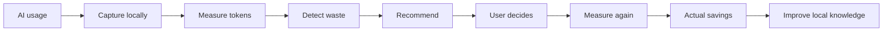
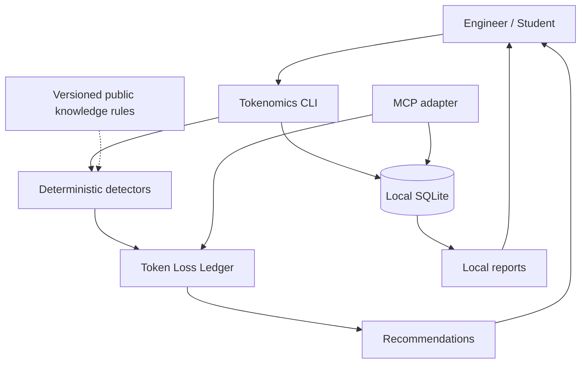

<div align="center">

# Tokenomics

### An AI Token Efficiency Project by GGCLTMGT

**Spend fewer tokens reaching a correct, verified result.**

Local-first AI token observability, waste detection, and measurable optimization for engineers and students.

[](https://github.com/thew0lf/tokenomics/actions/workflows/ci.yml)


[Quick start](#quick-start) · [Architecture](#architecture) · [MCP](#mcp) · [Privacy](#privacy) · [Documentation](#documentation)

</div>

---

## Why Tokenomics

AI usage is easy to measure and surprisingly hard to optimize.

The expensive part is often not a single large request. It is **rework**: an unchecked result, an unstated assumption, a hidden error, an unnecessarily large context, or an AI process that keeps getting called after the useful state has stopped changing.

Tokenomics treats tokens as an engineering resource. It records usage locally, identifies likely waste, recommends a change, and then measures whether the change actually saved anything.

> **The objective is not fewer tokens at any cost. The objective is fewer tokens to a correct, verified result.**

## Tokenomics in 60 seconds



Tokenomics does not assume that an optimization worked. An estimate is a hypothesis. The next measurement is the evidence.

## Architecture



The first implementation is intentionally local and deterministic. Tokenomics does not need a cloud service to analyze a command, calculate token cost, or identify a known waste pattern.

## Quick start

Requires Python 3.11+.

```bash
git clone https://github.com/thew0lf/tokenomics.git
cd tokenomics
python -m venv .venv
source .venv/bin/activate
python -m pip install -e '.[dev]'
```

Initialize local storage:

```bash
tokenomics init
```

Record usage without storing the conversation:

```bash
tokenomics record \
  --provider anthropic \
  --model claude \
  --input 12000 \
  --output 2500
```

View totals:

```bash
tokenomics report
```

Analyze a potentially wasteful workload:

```bash
tokenomics analyze 'while true; do curl localhost/ai; sleep 5; done' \
  --calls-per-minute 12
```

Record the privacy-safe findings in the local ledger when desired:

```bash
tokenomics analyze 'while true; do curl localhost/ai; sleep 5; done' \
  --calls-per-minute 12 \
  --record-losses
```

## MCP

Tokenomics now has an optional local MCP server for MCP-capable AI hosts.

Install the optional integration:

```bash
python -m pip install -e '.[mcp]'
```

Run it over local stdio:

```bash
tokenomics-mcp
```

The MCP surface is intentionally narrow:

| Tool | Purpose |
| --- | --- |
| `tokenomics_usage` | Aggregate local token usage |
| `tokenomics_findings` | Recent Token Loss Ledger observations |
| `tokenomics_savings` | Estimated versus measured savings |
| `tokenomics_recommendations` | Deterministic recommendations |

Resources:

- `tokenomics://summary`
- `tokenomics://findings`

MCP does **not** expose prompts, responses, source code, files, paths, credentials, arbitrary SQL, or unrestricted filesystem access. See [docs/MCP.md](docs/MCP.md).

## Waste detection

The initial detector set targets patterns that can create repeated or avoidable token spend.

| Pattern | What Tokenomics looks for | Why it matters |
| --- | --- | --- |
| AI polling | `while`, `watch`, repeated calls, scheduled polling | Unchanged state can repeatedly consume tokens |
| Hidden errors | `2>/dev/null`, suppressed stderr | Failures can turn into unnecessary rework |
| Pipeline status | `command \| tail` | Output truncation can obscure upstream failure status |
| Repeated context | Repeated input-token measurements | Stable context may be resent unnecessarily |
| Rework | Repeated attempts after unverified results | The same work can be paid for more than once |

Detection is deliberately conservative. A finding is an observation to investigate, not an automatic instruction to change a workflow.

## Token Loss Ledger

Every potential loss should eventually become a measurable record:

```text
Loss observed
    ↓
Why was it detected?
    ↓
How many tokens might be avoidable?
    ↓
What change is recommended?
    ↓
Did the user accept it?
    ↓
What happened on the next run?
    ↓
How many tokens were actually saved?
```

The local SQLite store persists loss observations separately from usage events. Each record contains only privacy-safe metadata: category, estimate, explanation, confidence, source, and recommendation outcome.

**Estimated savings ≠ actual savings.**

Tokenomics is designed to learn from the difference.

## Privacy

Tokenomics is built around a hard architectural boundary:

> **Private conversations and private project data stay on the user's machine.**

Tokenomics does not upload, share, or centralize:

- AI prompts or conversations
- AI responses
- Source code or file contents
- Filenames or local paths
- Environment variables or secrets
- API keys or credentials
- Personal messages or identifying information

Usage-event metadata is also allowlisted so callers cannot accidentally persist arbitrary prompt or project data through the local database model.

Community knowledge is different. Public knowledge consists of generalized rules, detection patterns, optimization strategies, and privacy-safe aggregate measurements. It does not require publishing the conversation that produced the discovery.

See [docs/PRIVACY.md](docs/PRIVACY.md) and [docs/MCP.md](docs/MCP.md).

## Design principles

1. **Local first**: analysis works without a Tokenomics cloud service.
2. **Privacy by architecture**: private content is not part of the shared data model.
3. **Deterministic before generative**: use cheap local rules before invoking an AI model.
4. **Measure the outcome**: recommendations are hypotheses until subsequent usage proves them.
5. **Net savings matter**: Tokenomics must account for its own analysis cost.
6. **Don't automate judgment**: findings inform the user; they do not silently change workflows.
7. **Vendor neutral by design**: Claude is the first target, not the permanent boundary.
8. **MCP is an adapter, not a data backdoor**: connected AI hosts get narrow domain capabilities, not arbitrary local access.

## Current MVP

The working foundation includes:

- Local SQLite usage events
- Local Token Loss Ledger persistence
- Input, output, cache-read, and cache-write token accounting
- Provider-neutral cost calculation using caller-supplied pricing
- Deterministic waste detection
- AI polling detection
- Hidden-error detection
- Pipeline-status detection
- Repeated-context detection
- Privacy-safe recommendations
- Privacy-safe usage metadata enforcement
- Optional local MCP server
- Automated tests and GitHub Actions CI

See [docs/MVP.md](docs/MVP.md) for completion criteria and deliberate non-goals.

## Roadmap

### Phase 1 · Local observability

- [x] Usage event model
- [x] Local SQLite storage
- [x] Token accounting
- [x] Deterministic detectors
- [x] Recommendation engine
- [x] Automated tests
- [x] CI
- [x] Token Loss Ledger persistence
- [x] Privacy-safe metadata boundary

### Phase 2 · Real AI integrations

- [ ] Claude/Anthropic usage capture
- [ ] Provider adapter interface
- [ ] Session reconstruction
- [ ] Real cache/token metadata ingestion
- [ ] Cost profiles and versioned pricing data

### Phase 3 · Optimization loop

- [ ] Recommendation approval workflow
- [ ] Actual-vs-estimated savings
- [ ] Rework detection across sessions
- [ ] Self-overhead accounting

### Phase 4 · Local dashboard

- [ ] Local web dashboard
- [ ] Token spend timeline
- [ ] Waste categories
- [ ] Savings history
- [ ] Session drill-down without cloud upload

### Phase 5 · Community knowledge

- [ ] Versioned knowledge packs
- [ ] Automatic knowledge updates
- [ ] Privacy-safe contribution workflow
- [ ] Provider-specific optimization rules

### Phase 6 · MCP

- [x] Local stdio MCP server
- [x] Aggregate usage tool
- [x] Token Loss Ledger tool
- [x] Savings tool
- [x] Deterministic recommendation tool
- [x] Privacy boundary tests
- [ ] MCP client configuration examples
- [x] MCP integration test against a reference client
- [ ] Optional read-only context-budget resource

## Review gates

Every significant feature is expected to pass two engineering review lenses before merge:

- **Senior AI Engineer review**: token economics, model-facing API design, privacy/data-flow boundaries, prompt/context risks, evaluation quality, and whether the feature creates more AI overhead than value.
- **Senior Software Engineer review**: architecture, correctness, tests, failure modes, dependency hygiene, security, maintainability, and backwards compatibility.

The repository should not mark a feature complete until its unit tests and review concerns are addressed.

## Repository layout

```text
tokenomics/
├── tokenomics/
│   ├── cli.py
│   ├── costs.py
│   ├── detectors.py
│   ├── ledger.py
│   ├── mcp_server.py
│   ├── models.py
│   ├── recommendations.py
│   └── storage.py
├── knowledge/
│   ├── patterns/
│   └── rules/
├── docs/
├── tests/
└── .github/workflows/ci.yml
```

## Documentation

- [Architecture](docs/ARCHITECTURE.md)
- [MVP](docs/MVP.md)
- [MCP](docs/MCP.md)
- [Usage](docs/USAGE.md)
- [Privacy](docs/PRIVACY.md)
- [Updating](docs/UPDATING.md)
- [Contributing](CONTRIBUTING.md)
- [Security](SECURITY.md)
- [Changelog](CHANGELOG.md)

## Contributing

Tokenomics is intentionally being built as an open engineering project. New detectors should be explainable, testable, conservative, and privacy-safe.

See [CONTRIBUTING.md](CONTRIBUTING.md).

## License

Apache License 2.0. See [LICENSE](LICENSE).

Copyright © 2026 GGCLTMGT.
